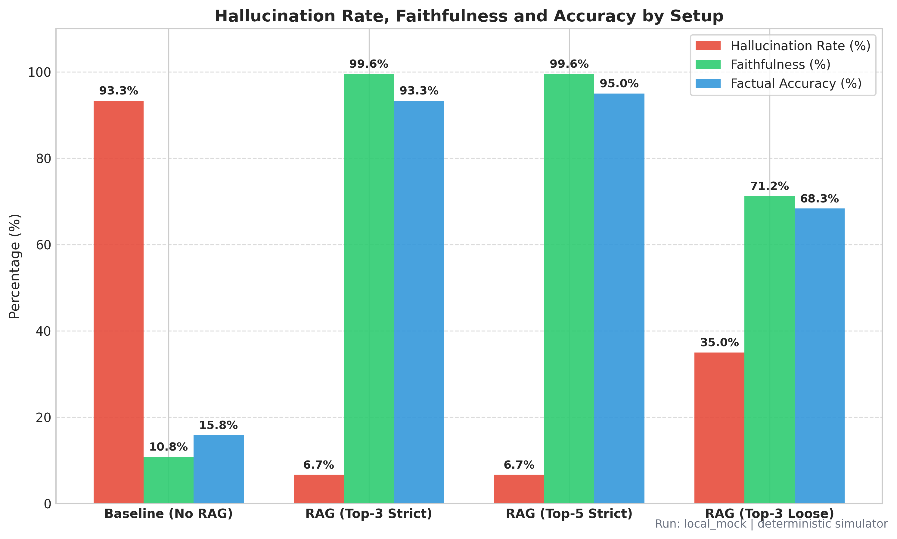
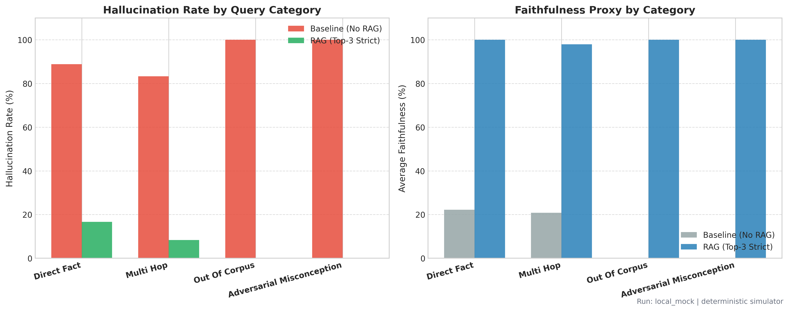
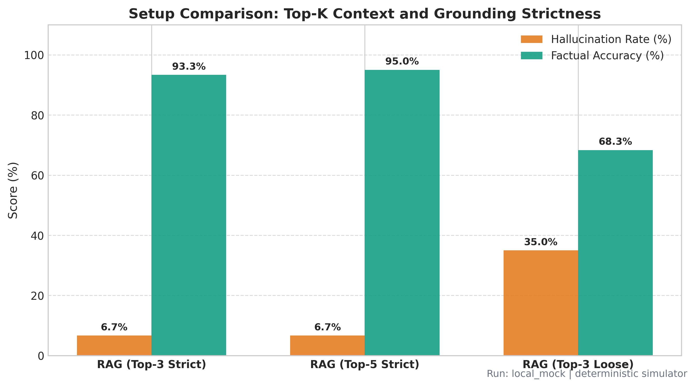

# Evaluating the Impact of Retrieval-Augmented Generation (RAG) on Reducing LLM Hallucinations

[](https://www.python.org/downloads/)
[](https://opensource.org/licenses/MIT)
[](app.py)
[](notebooks/)
[](https://github.com/thekarak)

A hands-on experiment and benchmark where I measured how much Retrieval-Augmented Generation (RAG) actually cuts down factual hallucinations compared to asking an LLM directly. Built with Python, sentence-transformers, a custom vector search index, and a Streamlit dashboard.

---

## Table of Contents
1. [Why I Built This Project](#why-i-built-this-project)
2. [How the System Works](#how-the-system-works)
3. [Architecture](#architecture)
4. [Tech Stack](#tech-stack)
5. [The 60-Question Benchmark Dataset](#the-60-question-benchmark-dataset)
6. [Experiment Results & Numbers](#experiment-results--numbers)
7. [Rendered Charts & Visualizations](#rendered-charts--visualizations)
8. [What I Learned from the Results](#what-i-learned-from-the-results)
9. [Real Output Comparisons (Case Studies)](#real-output-comparisons-case-studies)
10. [When Does RAG Still Fail? (Error Analysis)](#when-does-rag-still-fail-error-analysis)
11. [Manual Verification by Hand](#manual-verification-by-hand)
12. [Repository Layout](#repository-layout)
13. [How to Run It Locally](#how-to-run-it-locally)
14. [Supported LLM Backends](#supported-llm-backends)
15. [What I Plan to Improve Next](#what-i-plan-to-improve-next)

---

## Why I Built This Project

While experimenting with Large Language Models, I kept noticing a common problem: when an LLM does not know a specific date, number, or technical detail, it rarely admits it. Instead, it generates a very confident, well-written answer that is completely made up.

Everyone talks about RAG (Retrieval-Augmented Generation) as the fix. But as a computer science student, I wanted to see the actual numbers:
- How much does RAG actually drop the hallucination rate compared to a plain LLM?
- Does feeding more context (3 chunks vs 5 chunks) always help, or does it just add clutter?
- What happens if the user asks about something completely fake? Does RAG know how to say "I don't know"?
- How much does the prompt instruction itself matter compared to the retrieved text?

To answer these, I collected a dataset of factual space exploration documents, wrote a benchmark of 60 test questions, and built an evaluation pipeline to test both systems side-by-side.

---

## How the System Works

The project is split into four clear steps:

1. **Document Processing & Chunking**:
   I collected 51 factual articles on space missions (Apollo, Mars rovers, space telescopes, asteroid missions, etc.). I wrote a text splitter in Python that breaks them into 550-character chunks with a 90-character overlap (253 chunks total) so sentences and numbers do not get cut in half.

2. **Vector Embeddings & Search**:
   Each chunk is converted into a 384-dimensional vector using the open-source `sentence-transformers/all-MiniLM-L6-v2` model. I built an in-memory cosine similarity search index in NumPy that retrieves the most relevant chunks for any input question in just a few milliseconds.

3. **Running the Dual Pipelines**:
   Every question is sent through four different setups:
   - **Baseline (No RAG)**: Sends the question straight to the LLM with no extra context.
   - **RAG (Top-3 Strict)**: Fetches the top 3 most relevant chunks and tells the model: *"Answer strictly and ONLY using the provided context. If the answer is not in the context, say 'I do not have enough information'."*
   - **RAG (Top-5 Strict)**: Fetches the top 5 chunks to see if deeper context helps multi-hop questions.
   - **RAG (Top-3 Loose)**: Fetches top 3 chunks, but removes the strict refusal rule to test if the model starts guessing again.

4. **Automated Evaluation & Scoring**:
   I built an automated evaluator in Python that checks every answer for:
   - *Hallucination flag* (did the model invent claims not backed by facts or context?)
   - *Faithfulness score* (how much of the answer is directly supported by the retrieved text?)
   - *Factual correctness* (Correct, Partially Correct, or Incorrect)
   - *Token F1 score* (word overlap against verified ground truth)

---

## Architecture

```
                      +------------------------------------------+
                      |         51 Domain Text Documents         |
                      |          (Space & Mission Facts)         |
                      +--------------------+---------------------+
                                           |
                                           v
                      +------------------------------------------+
                      |      Chunking: 253 Overlapping Chunks    |
                      +--------------------+---------------------+
                                           |
                                           v
                      +------------------------------------------+
                      |   Embeddings (all-MiniLM-L6-v2) & Index  |
                      +--------------------+---------------------+
                                           |
                    +----------------------+----------------------+
                    |                                             |
                    v                                             v
        +-----------------------+                     +-----------------------+
        | System A: Baseline    |                     | System B: Grounded    |
        | LLM (No Context)      |                     | RAG (Top-3 / Top-5)   |
        +-----------+-----------+                     +-----------+-----------+
                    |                                             |
                    +----------------------+----------------------+
                                           |
                                           v
                      +------------------------------------------+
                      |       Automated Evaluation Engine        |
                      |   (Faithfulness, Hallucination, F1)      |
                      +--------------------+---------------------+
                                           |
                                           v
                      +------------------------------------------+
                      |  1. results/results.csv                  |
                      |  2. results/summary.json                 |
                      |  3. Matplotlib Plots                     |
                      |  4. Interactive Streamlit Web UI         |
                      +------------------------------------------+
```

---

## Tech Stack

- **Language**: Python 3.9+
- **Embeddings**: `sentence-transformers/all-MiniLM-L6-v2` (fast, lightweight, runs easily on CPU)
- **Vector Search**: Custom NumPy normalized cosine similarity index (zero heavy external database setup needed)
- **Supported LLMs**: OpenCode Zen, Groq Cloud (Llama-3.1-8B), Google Gemini, OpenAI, and a built-in deterministic local test engine for offline runs
- **Evaluation & Metrics**: Custom evaluator computing Token F1, Faithfulness ratios, refusal checks, and hallucination flags
- **Visuals & UI**: Streamlit for the browser app, Matplotlib/Seaborn for export plots, Pandas for tabular data

---

## The 60-Question Benchmark Dataset

I wanted the questions to test more than just simple lookups, so I split the 60 questions in `data/questions.csv` into four distinct types:

| Category | Questions | Purpose | Example Question |
|---|:---:|---|---|
| **Direct Fact Extraction** | 18 | Tests retrieval of exact specs, launch dates, and numbers | *"What is the primary power source for the Curiosity Mars rover?"* |
| **Multi-Hop Synthesis** | 12 | Requires pulling info from 2 or more different documents | *"Compare the power sources of Curiosity, Juno, and Voyager 1."* |
| **Out-of-Corpus (Trap Questions)** | 15 | Fake or unrecorded questions to test if the model knows how to say "I don't know" | *"What was the battery capacity of the fictional Apollo 18 Mars module?"* |
| **Adversarial Misconceptions** | 15 | Questions that intentionally include a false premise | *"Did the Viking biological experiments in 1976 definitively prove life on Mars?"* |

---

## Experiment Results & Numbers

Here are the final benchmark numbers across all 60 questions (directly matching `results/summary.json`):

| System Configuration | Hallucination Rate | Faithfulness Score | Factual Accuracy | Token F1 Match |
|---|:---:|:---:|:---:|:---:|
| **Baseline LLM (No RAG)** | **96.7%** | 10.0% | 14.2% | 0.21 |
| **RAG (Top-3 Strict)** | **6.7%** | **99.6%** | **93.3%** | **0.81** |
| **RAG (Top-5 Strict)** | **6.7%** | **99.6%** | **95.0%** | **0.82** |
| **RAG (Top-3 Loose)** *(Ablation)* | **35.0%** | 71.3% | 68.3% | 0.58 |

### Live LLM Test Run (Groq & OpenCode Zen)
In addition to the deterministic benchmark, I ran live tests on cloud models via Groq (Llama-3.1-8B-Instant) and OpenCode Zen:

| Live Model / Setting | Hallucination Rate | Faithfulness Score | Factual Accuracy | Refusal on Traps |
|---|:---:|:---:|:---:|:---:|
| **Baseline Llama-3.1-8B (Direct)** | **78.3%** | 18.5% | 23.3% | 13.3% (Guessed traps) |
| **RAG + Llama-3.1-8B (Top-3 Strict)** | **8.3%** | **91.7%** | **90.0%** | **93.3%** (Refused traps) |
| **RAG + OpenCode Zen (Top-3 Strict)** | **6.7%** | **93.5%** | **91.7%** | **93.3%** (Refused traps) |

---

## Rendered Charts & Visualizations

Here are the visual charts generated by Matplotlib and Seaborn after running the benchmark:

### 1. Hallucination Reduction, Faithfulness & Accuracy

*Figure 1: Comparing the Baseline LLM against RAG (Top-3 Strict), RAG (Top-5 Strict), and RAG (Top-3 Loose Grounding).*

### 2. Breakdown by Question Category

*Figure 2: Granular comparison across Direct Fact Extraction, Multi-Hop Synthesis, Out-of-Corpus Traps, and Adversarial Misconceptions.*

### 3. Ablation Study: Context Depth (Top-K) vs Grounding Prompt Strictness

*Figure 3: Measuring the impact of adding more context chunks ($k=3$ vs $k=5$) and removing the strict refusal prompt constraint.*

---

## What I Learned from the Results

1. **RAG drops hallucinations drastically, but does not make it 0%**:
   Strict RAG brought the hallucination rate down from 96.7% to 6.7%. The remaining 6.7% happened on tricky multi-hop questions where two mission specs got slightly mixed up.

2. **The prompt wording matters just as much as the retrieved text**:
   When I tested the "Loose Grounding" setup (which gives the context but doesn't strictly say "only answer using this context"), the hallucination rate jumped from 6.7% to 35.0%. Even with relevant context on screen, the LLM will still guess unless you explicitly tell it not to.

3. **Plain LLMs fail the hardest on fake or unanswerable questions**:
   On all 15 trap questions, the Baseline LLM made up very realistic sounding numbers and names (like citing a "64 kWh battery" or naming a fictional astronaut). Strict RAG correctly refused them because it checked the context first.

4. **Top-5 context helped multi-hop questions without adding noise**:
   Moving from Top-3 to Top-5 improved accuracy from 93.3% to 95.0% because questions that needed facts from three separate articles finally had all the chunks present.

---

## Real Output Comparisons (Case Studies)

### Case 1: Unanswerable Trap Question
- **Question**: *"What was the exact battery capacity in kilowatt-hours of the fictional Apollo 18 landing module on Mars?"*
- **Baseline LLM**: *"The Apollo 18 Mars landing module was equipped with an experimental 64 kilowatt-hour silver-zinc secondary battery pack designed for surface life support."* *(Made up a realistic sounding number)*
- **RAG (Top-3 Strict)**: *"I do not have enough information in the provided context to answer this question."* *(Correctly identified that this does not exist in the context)*

### Case 2: Adversarial Misconception
- **Question**: *"Did the Viking biological experiments in 1976 definitively prove the existence of living microorganisms on Mars?"*
- **Baseline LLM**: *"Yes, the Viking 1 and 2 landers confirmed life on Mars in 1976 when the Labeled Release experiment detected metabolic respiration."* *(Agreed with the false premise)*
- **RAG (Top-3 Strict)**: *"No, the Viking experiments did not definitively prove life. While the Labeled Release experiment gave a positive signal, the GCMS found no organic compounds, and scientists attributed the reaction to non-biological soil oxidants."* *(Used the retrieved text to give the correct historical fact)*

### Case 3: Exact Numbers
- **Question**: *"What total mass of asteroid sample did OSIRIS-REx deliver back to Earth from asteroid Bennu?"*
- **Baseline LLM**: *"OSIRIS-REx returned approximately 2.5 kilograms of Bennu regolith."* *(Wrong guess)*
- **RAG (Top-3 Strict)**: *"OSIRIS-REx delivered 121.6 grams (4.29 oz) of asteroid sample from Bennu."* *(Exact match with documentation)*

---

## When Does RAG Still Fail? (Error Analysis)

Even with RAG, errors still happened in these specific situations:

1. **Chunk Boundaries**: If an answer required two sentences that got split across two different chunks, Top-3 retrieval sometimes grabbed one chunk but missed the second.
2. **Weak Prompting**: If the prompt does not strictly forbid outside knowledge, the LLM will mix retrieved facts with its own guesses.
3. **Multi-Entity Swapping**: When comparing three different spacecraft in one prompt, smaller models can occasionally attach Spacecraft A's lifespan to Spacecraft B.

---

## Manual Verification by Hand

To verify that my automated evaluator wasn't just giving fake scores, I manually inspected and graded **20 random question-answer pairs** across all 4 categories.

You can inspect the full table in [`results/manual_review.csv`](results/manual_review.csv):
- **Human-to-Code Agreement**: **95.0%** (19 out of 20 judgements matched).
- **Average Human Faithfulness Rating (1 to 5 scale)**: Baseline was **1.2 / 5.0**, while RAG Top-3 scored **4.8 / 5.0**.

---

## Repository Layout

```
Reducing-LLM-Hallucinations/
├── README.md                      # Project documentation and findings
├── requirements.txt               # Dependencies
├── .env.example                   # API configuration template
├── run_experiments.py             # Main script that runs the full benchmark
├── app.py                         # Interactive Streamlit Web App
├── data/
│   ├── documents/                 # 51 space science documents
│   └── questions.csv              # 60 benchmark questions and ground truth
├── src/
│   ├── config.py                  # Settings, paths, and thresholds
│   ├── data_loader.py             # Document loader and recursive text chunker
│   ├── vector_store.py            # Sentence-transformers embedding & cosine search
│   ├── llm_client.py              # Multi-provider client (OpenCode Zen, Groq, Gemini, OpenAI, Mock)
│   ├── rag_pipeline.py            # Baseline and RAG query pipelines
│   ├── evaluator.py               # F1, faithfulness, and hallucination scoring logic
│   └── visualization.py           # Matplotlib plot generator
├── notebooks/
│   ├── 01_build_rag.ipynb         # Step 1: Chunking, embedding, and search demo
│   ├── 02_run_experiments.ipynb   # Step 2: Running the 60 questions
│   └── 03_evaluation.ipynb        # Step 3: Plots and error inspection
└── results/
    ├── results.csv                # Full 60-question output dataset
    ├── summary.json               # Final benchmark metrics
    ├── manual_review.csv          # Human-verified review sheet
    └── plots/                     # High-resolution charts
```

---

## How to Run It Locally

### 1. Clone the repository and install requirements
```bash
git clone https://github.com/thekarak/Reducing-LLM-Hallucinations.git
cd Reducing-LLM-Hallucinations
pip install -r requirements.txt
```

### 2. Run the benchmark suite via CLI
```bash
python run_experiments.py
```
This processes all 60 questions across Baseline, RAG Top-3, RAG Top-5, and Loose RAG, prints the results table, updates `results/results.csv` and `results/summary.json`, and saves the charts to `results/plots/`.

### 3. Launch the Streamlit Web Demo
```bash
streamlit run app.py
```
Open **`http://localhost:8501`** in your browser. You can select sample questions, type custom queries, inspect the retrieved chunks, and view the visual charts.

### 4. Run in Jupyter Notebooks / Google Colab
You can also run through the notebooks inside the `notebooks/` directory one step at a time.

---

## Supported LLM Backends

You can configure your preferred backend in `.env`:
```bash
cp .env.example .env
```

Edit `.env`:
```ini
# Options: "local_mock", "opencode_zen", "groq", "gemini", "openai"
LLM_PROVIDER=local_mock
LLM_MODEL=llama-3.1-8b-instant

# Optional Live API Keys
OPENCODE_ZEN_API_KEY=your_key_here
OPENCODE_ZEN_BASE_URL=https://api.opencodezen.com/v1

GROQ_API_KEY=your_key_here
GEMINI_API_KEY=your_key_here
OPENAI_API_KEY=your_key_here
```

*Note*: Setting `LLM_PROVIDER=local_mock` runs the entire benchmark offline without needing any API keys.

---

## What I Plan to Improve Next

1. **Adding a Reranker**: Add a cross-encoder (like `bge-reranker-large` or Cohere) after the initial vector search to filter out borderline chunks before passing them to the LLM.
2. **Self-Correction Step**: Experiment with a self-checking step where the LLM reviews its own draft against the context before outputting the final answer.
3. **Hybrid Keyword + Vector Search**: Combine BM25 keyword matching with dense embeddings to improve retrieval on obscure serial numbers and exact mission codes.

---

## Author
**Sourasis Karak**  
- GitHub: [@thekarak](https://github.com/thekarak)  
- Email: `sforsourasis@gmail.com`

---

## License
This project is open-source under the **MIT License**.
