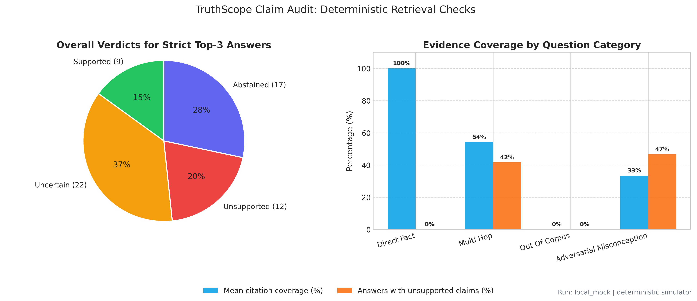

# TruthScope: An Evidence-First RAG Hallucination Project

[](https://www.python.org/)
[](app.py)
[](LICENSE)

I built this project to test a simple idea: an LLM answer should be easy to verify.

This repository compares normal LLM answers with Retrieval-Augmented Generation (RAG), then adds **TruthScope**—a layer that breaks an answer into claims, checks each claim against retrieved evidence, and explains when the answer should be trusted or questioned.

> **Student project, not a published research study.** The committed benchmark results were generated with a deterministic local simulator. They are useful for demonstrating the pipeline, but they are not real-world claims about every LLM.

---

## What TruthScope Does

TruthScope is the main interactive part of the project.

- **Claim Inspector** splits an answer into individual factual claims.
- **Evidence Checker** marks each claim as supported, uncertain, unsupported, unverified, or abstained.
- **Risk Radar** warns when a question has a false premise, weak evidence, or unusually precise wording.
- **Learning Coach** turns a failed answer into a short explanation and a practice question.
- **System Comparison** shows the normal LLM answer beside the grounded RAG answer.
- **Evidence Viewer** shows the exact source chunk and sentence used for verification.
- **Local Mode** lets the complete demo run without a paid API key.

The claim checker is explainable and deterministic, but it is still a heuristic. It checks support against the indexed corpus; it does not prove that a statement is true everywhere.

---

## Quick Start

### 1. Install the project

```bash
git clone https://github.com/thekarak/Reducing-LLM-Hallucinations.git
cd Reducing-LLM-Hallucinations
python -m venv .venv
```

Activate the environment:

```bash
# Windows
.venv\Scripts\activate

# macOS or Linux
source .venv/bin/activate
```

Install the dependencies:

```bash
pip install -r requirements.txt
```

### 2. Start the app

```bash
streamlit run app.py
```

Open [http://localhost:8501](http://localhost:8501).

The default **Local Simulator** works without API keys. You can enter another provider key in the sidebar when you want to test a live model.

### 3. Run the tests

```bash
python -m unittest discover -s tests -v
```

### 4. Run the benchmark

```bash
python run_experiments.py
```

For a smaller smoke test:

```bash
python run_experiments.py --limit 5
```

The benchmark writes results to `results/`, including CSV files, JSON summaries, and charts.

---

## Why I Built It

LLMs often sound confident even when they do not know the answer. The problem is especially common with exact dates, measurements, names, and fictional questions.

I wanted to test four things:

1. Does retrieval reduce unsupported answers?
2. Is Top-5 context always better than Top-3?
3. Does strict prompting improve refusal behavior?
4. Can a student build a useful evaluation tool without a large vector database or expensive infrastructure?

The first version focused on a 60-question benchmark. TruthScope came later because aggregate scores showed *that* something changed, but not clearly *why* it changed.

---

## Project Flow

```text
Space-mission documents
          |
          v
   Text chunking
          |
          v
Embeddings + keyword search
          |
          v
Relevant evidence chunks
          |
          +-----------------------+
          |                       |
          v                       v
   Normal LLM answer      Strict RAG answer
                                  |
                                  v
                          TruthScope analysis
                                  |
                    +-------------+-------------+
                    |             |             |
                    v             v             v
             Claim verdicts   Risk radar   Learning coach
```

### 1. Document processing

The project contains 51 short documents about space missions. Each document is split into 550-character chunks with a 90-character overlap.

### 2. Retrieval

The main path uses `all-MiniLM-L6-v2` embeddings and cosine similarity. The project can also combine dense retrieval with BM25 through Reciprocal Rank Fusion.

If `sentence-transformers` is unavailable, the code falls back to TF-IDF so the project can still run locally.

### 3. Answer generation

The experiment compares four setups:

| Setup | Purpose |
|---|---|
| Baseline | Sends the question without retrieved context |
| Strict RAG, Top-3 | Uses three chunks and requires evidence-based answers |
| Strict RAG, Top-5 | Tests whether deeper context helps |
| Loose RAG, Top-3 | Tests how the system behaves without a strict refusal rule |

### 4. Evaluation

The evaluator records:

- Hallucination flag
- Faithfulness score
- Factual correctness
- Token-level F1
- Refusal detection
- Human-readable evaluation notes
- Retrieved evidence and retrieval scores

For live models, faithfulness can use an LLM judge. Offline runs use a deterministic clause-support heuristic.

---

## TruthScope Analysis

TruthScope adds a separate analysis layer after answer generation.

For every claim, it:

1. Removes low-value words and focuses on names, numbers, dates, and key terms.
2. Finds the closest sentence in the retrieved evidence.
3. Measures overlap between the claim and that sentence.
4. Checks for conflicting negation, such as claiming something **did not** happen when the evidence says it **did**.
5. Produces a verdict and a short explanation.

These labels are also saved in the benchmark output for the strict Top-3 run.

---

## Benchmark Dataset

`data/questions.csv` contains 60 questions in four categories:

| Category | Count | What it tests |
|---|---:|---|
| Direct facts | 18 | Exact names, dates, and measurements |
| Multi-hop questions | 12 | Combining facts from multiple documents |
| Out-of-corpus traps | 15 | Fictional or unanswerable questions |
| Adversarial misconceptions | 15 | Questions built around a false assumption |

The trap questions are important. A system that always answers is not necessarily reliable; knowing when the corpus is insufficient is part of the task.

---

## Committed Benchmark Results

These values come from the deterministic local simulator stored in `results/summary.json`.

| Setup | Hallucination rate | Faithfulness | Accuracy | Token F1 |
|---|---:|---:|---:|---:|
| Baseline, no RAG | 93.3% | 10.8% | 15.8% | 0.22 |
| Strict RAG, Top-3 | 6.7% | 99.6% | 93.3% | 0.85 |
| Strict RAG, Top-5 | 6.7% | 99.6% | 95.0% | 0.85 |
| Loose RAG, Top-3 | 35.0% | 71.2% | 68.3% | 0.62 |

The token F1 values changed when I fixed repeated-token counting, so the table above now matches the current `results/summary.json` exactly.

These numbers should be read as a reproducible test of the benchmark software. A fair LLM evaluation needs multiple live models, repeated runs, better test questions, confidence intervals, and independently reviewed labels.

---

## Results and Visualizations

All four charts below were regenerated from the current `results/results.csv` on the deterministic local simulator run.

### Setup comparison


### Results by question category


The baseline has no retrieved context, so its faithfulness column is only a ground-truth-overlap proxy. It is not a direct context-support measurement.

### Top-K and prompt ablations


### TruthScope claim audit



This chart uses the strict Top-3 answers. TruthScope reports 17 abstentions, 9 supported answers, 22 uncertain answers, and 12 answers with an unsupported claim. These counts are stricter than the benchmark's answer-level hallucination flag because TruthScope checks individual claims and can flag a partly supported answer as uncertain.

---

## Where RAG Still Fails

RAG is useful, but it does not remove hallucinations automatically.

The main failure patterns I found are:

- **Retrieval miss:** the correct sentence is in the corpus but is not retrieved.
- **Bad chunk boundary:** the needed fact is split across two chunks.
- **Prompt weakness:** the model mixes outside knowledge with the retrieved context.
- **Entity confusion:** facts from two missions get combined incorrectly.
- **Weak verification:** token overlap finds similar words but misses deeper semantic errors.
- **Poor evaluation data:** a small hand-written benchmark can overfit to the prompts and models used to build it.

TruthScope makes some of these failures visible, but it cannot solve them automatically.

---

## Supported Providers

The app supports:

- Local deterministic simulator
- Groq
- OpenCode Zen
- Google Gemini
- OpenAI

To configure providers through a file:

```bash
cp .env.example .env
```

Then edit `.env`:

```ini
LLM_PROVIDER=local_mock
LLM_MODEL=llama-3.1-8b-instant

GROQ_API_KEY=your_key_here
GEMINI_API_KEY=your_key_here
OPENAI_API_KEY=your_key_here
OPENCODE_ZEN_API_KEY=your_key_here
```

Do not commit `.env` or real API keys.

---

## Tech Stack

- Python
- Streamlit
- Sentence Transformers
- NumPy and scikit-learn
- Rank-BM25
- Pandas
- Matplotlib and Seaborn
- OpenAI, Groq, and Gemini API clients

I intentionally avoided a large vector database. The project uses a small in-memory index so the complete system is easier to run, inspect, and modify.

---

## Project Structure

```text
Reducing-LLM-Hallucinations/
├── app.py                     # TruthScope Streamlit app
├── run_experiments.py         # Benchmark runner
├── data/
│   ├── documents/             # 51 space-mission documents
│   └── questions.csv          # 60 benchmark questions
├── src/
│   ├── data_loader.py         # Loading and chunking
│   ├── vector_store.py        # Dense, hybrid, and TF-IDF retrieval
│   ├── llm_client.py          # Provider routing and offline simulator
│   ├── rag_pipeline.py        # Baseline and RAG pipelines
│   ├── truthscope.py          # Claims, risk, evidence, and coaching
│   ├── evaluator.py           # Benchmark scoring
│   └── visualization.py       # Result charts
├── tests/
│   └── test_truthscope.py     # Core regression tests
├── notebooks/                 # Step-by-step notebooks
└── results/                   # CSV, JSON, manual review, and charts
```

---

## Next Improvements

The next useful improvements are:

1. Replace the deterministic simulator with a larger set of recorded live-model runs.
2. Add retrieval metrics such as Recall@k, MRR, and nDCG.
3. Test different chunk sizes, thresholds, and Top-K values automatically.
4. Add a compact cross-encoder reranker.
5. Create a larger misconception library with reviewed explanations.
6. Compare TruthScope verdicts with independent human labels.

---

## What I Learned Building This

The biggest lesson was that RAG is not one model feature. It is a complete pipeline, and the answer quality depends on every part of it.

Building the project taught me that:

- **Retrieval quality matters before generation quality.** If the evidence is missing, a better prompt cannot recover the correct fact.
- **A refusal is often the correct answer.** Filling every gap with a guess makes the system less trustworthy.
- **More context is not always better.** Top-5 can help multi-hop questions, but it can also add irrelevant information.
- **One aggregate score hides too much.** Claim-level evidence makes errors easier to understand.
- **Evaluation is part of the application.** I needed to test token matching, refusal detection, persistence, and provider fallbacks—not just write a generation prompt.
- **Small projects still need honest limits.** A clean demo is useful, but synthetic results should not be presented as research conclusions.
- **Explainability helped me learn.** Seeing the exact evidence behind a verdict made the system easier to debug than a score by itself.

I also learned the less exciting parts: managing API keys, saving fitted vectorizers, handling stale indexes, making retries explicit, and writing tests before an “AI feature” feels finished.

---

## Author

**Sourasis Karak**
GitHub: [@thekarak](https://github.com/thekarak)

## License

[MIT](LICENSE)
